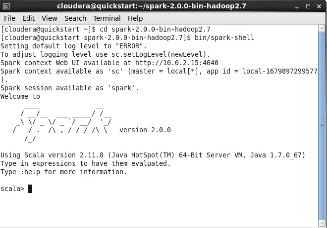

# Code-Chapter-3
Nama : Welson Mario Naibaho

Kelas : TI 3C

NIM : 2041720253

Matakuliah : Big Data

## Langkah-langkah dan penjelasan

1. Pertama masuk ke folder spark dengan cara

    <code> cd spark-2.0.0-bin-hadoop2.7</code>
    
2. Kemudian jalankan

    <code> bin/pyspark </code>

3. Mencoba <code>Accumulator.py</code>

    Disini berhasil untuk print myaccum.value. dan outputnya adalah 4950

4. Mencoba <code>BroadCast.py</code>

    Pada percobaan BroadCast, berhasil membuat list 1 sampai dengan 99 dengan atribut broadcastVar.value

5. Mencoba <code>LogAnalytics</code>

    - Disini membuat file dummy berformat .text kedalam direktori file://home/cloudera
    - Code diatas berfungsi untuk memfilter kata "Error" dan "Product"
    - Hasil dari LogAnalyrics menujukkan bahwa Total number of error record are 0 and Number of product pages visited that have Errors is 0
    - Menujukkan bahwa file sample3.txt tidak memiliki nilai error dan nilai product pada log file.

6. Mencoba <code>PairRDD</code>

    myPairRDD.key().collect()
        - menampilkan nilai dari mylist
    myPairRDD.values().collect()
        - Menampilkan jumlah kata dari collection

7. Mencoba <code>UnderstandingRDDS.py</code>

    Pada percobaan diatas, membuat sebuah list dengan menghitung jumlah partisi dan kemudian menampilkan data pada collection

8. Mencoba <code>WordCount.py</code>

    Dari percobaan diatas, dilakukan penjumlahan menggunakan atribut counts.collect()

### UJI COBA FILE .SCALA

    Pada terminal jalankan spark-shell dengan cara

- <code>cd spark-2.0.0-bin-hadoop2.7</code>

        Kemudian lakukan

- <code>bin/spark-shell</code>

    Pada Cloudera Manager, jalankan service HDFS

1. Mencoba <code>SystemCommandsOutput.scala</code>

    Hasil dari percobaan diatas adalah string "" dan result = , dikarenakan tidak terdapat file yang akan dihadoop

2. Mencoba <code>SystemCommandsReturnCode.scala</code>

    Dari percobaan diatas, menampilkan folder yang berisi temp file

# TUGAS 2
PERTANYAAN

Jelaskan masing-masing maksud kode berikut sesuai nomor kode.

Kode 1: sc, accumulator, parallelize, lambda, value

Kode 2: broadcast, list, range

Kode 3: textFile, filter, cache, count

Kode 4: map, collect, len, keys, values

Kode 5: defaultParallelism, getNumPartitions, 
mapPartitionsWithIndex, repartition, coalesce, toDebugString

Kode 6: flatMap, reduceByKey, split

JAWABAN :

## KODE 1

    1. sc = sc merupakan singkatan dari SparkContext yang merupakan entry/titik masuk utama untuk fungsionalitas Spark.

    2. accumulator = adalah sebuah variabel yang dapat diakses oleh semua worker pada sebuah cluster dan digunakan untuk mengakumulasi hasil dari opertor pararel

    3. parallelize = adalah metode pada SparkContext yang digunakan untuk membuat RDD (Resilient Distributed Dataset) dari koleksi data yang ada pada driver program.
    Metode parallelize akan membagi koleksi data menjadi beberapa bagian (partisi) dan mendistribusikannya secara otomatis ke worker node dalam cluster, sehingga memungkinkan proses komputasi yang paralel pada masing-masing worker node.

    4. lamda = adalah sebuah fungsi anonim dalam bahasa pemrograman Python yang digunakan untuk melakukan transformasi data pada RDD (Resilient Distributed Dataset) pada Spark.Lamda berfungsi untuk mengurangi penulisan kode yang berlebihan dan membantu mempercepat proses pemrograman.

    5. value = adalah kumpulan data yang dapat dibagi menjadi beberapa bagian (partisi) dan didistribusikan ke beberapa node dalam sebuah cluster, sehingga memungkinkan proses komputasi yang paralel pada masing-masing node

## KODE 2

    1. broadcast = adalah salah satu fitur yang digunakan untuk mengoptimalkan pengiriman data ke worker node dalam sebuah cluster. 
    broadcast memungkinkan pengiriman data yang lebih efisien dengan mengirimkan variabel yang hanya perlu dikirimkan satu kali dari driver program ke worker node.

    2. list = adalah salah satu jenis data yang dapat digunakan dalam memproses data besar secara paralel
    list digunakan untuk menyimpan dan memproses kumpulan data yang terdistribusi di beberapa node dalam sebuah cluster.

    3. range = adalah salah satu fungsi yang digunakan untuk membuat RDD (Resilient Distributed Dataset) yang berisi kumpulan bilangan bulat dalam rentang tertentu.

## KODE 3

    1. textfile = adalah salah satu metode yang digunakan untuk membaca file teks pada Spark dan mengubahnya menjadi RDD (Resilient Distributed Dataset).

    2. filter = adalah salah satu operasi transformasi pada RDD (Resilient Distributed Dataset) yang digunakan untuk memfilter elemen-elemen RDD berdasarkan kondisi yang diberikan.

    3. cache = adalah salah satu metode yang digunakan untuk menyimpan RDD (Resilient Distributed Dataset) dalam memori pada node-node dalam sebuah cluster.
    Metode ini memungkinkan RDD yang sering digunakan dalam operasi transformasi dan aksi untuk disimpan dalam memori, sehingga dapat mengurangi waktu yang dibutuhkan untuk memproses RDD.

    4. count = adalah sebuah fungsi yang digunakan untuk menghitung jumlah elemen dalam sebuah RDD (Resilient Distributed Dataset). Fungsi ini mengembalikan sebuah bilangan bulat yang merupakan jumlah elemen dalam RDD tersebut.

## KODE 4

    1. map = adalah sebuah fungsi yang digunakan untuk melakukan transformasi pada setiap elemen dalam sebuah RDD (Resilient Distributed Dataset) dan mengembalikan RDD baru. Fungsi ini digunakan untuk mengubah nilai setiap elemen dalam RDD berdasarkan suatu kondisi atau operasi tertentu.

    2. collect = adalah sebuah fungsi yang digunakan untuk mengumpulkan semua elemen dalam RDD (Resilient Distributed Dataset) dan mengembalikan hasilnya dalam bentuk list pada driver program. Fungsi ini digunakan untuk mengambil semua data hasil transformasi pada RDD dan mengembalikan ke driver program sebagai hasil akhir.

    3. len = adalah sebuah fungsi yang digunakan untuk menghitung jumlah elemen dalam RDD (Resilient Distributed Dataset). Fungsi ini digunakan untuk mendapatkan jumlah elemen dalam RDD yang dapat digunakan untuk berbagai tujuan, seperti memastikan bahwa RDD yang dibuat telah berhasil atau mengetahui ukuran RDD tersebut.
    
    4. keys = adalah sebuah fungsi yang digunakan untuk mengembalikan semua kunci (key) dalam sebuah RDD (Resilient Distributed Dataset) yang berisi pasangan kunci-nilai (key-value pair). RDD dengan pasangan kunci-nilai biasanya digunakan pada operasi-transformasi seperti groupByKey, reduceByKey, atau join.
    Fungsi keys pada Spark dapat digunakan pada RDD dengan pasangan kunci-nilai, yang mana hanya akan mengembalikan kunci dari setiap pasangan tersebut.

    5. values = adalah sebuah fungsi yang digunakan untuk mengembalikan semua nilai dalam sebuah RDD (Resilient Distributed Dataset) yang berisi pasangan kunci-nilai (key-value pair). RDD dengan pasangan kunci-nilai biasanya digunakan pada operasi-transformasi seperti groupByKey, reduceByKey, atau join.
    Fungsi values pada Spark dapat digunakan pada RDD dengan pasangan kunci-nilai, yang mana hanya akan mengembalikan nilai dari setiap pasangan tersebut.

## KODE 5

    1. defaultParallelism = adalah sebuah konfigurasi yang menentukan jumlah partisi default yang akan dibuat ketika membuat RDD (Resilient Distributed Dataset) baru pada Spark.

    2. getNumPartitions = adalah fungsi pada Spark yang digunakan untuk mendapatkan jumlah partisi dari RDD (Resilient Distributed Dataset) yang dibuat pada Spark.
    Fungsi getNumPartitions() tidak memerlukan argumen dan mengembalikan nilai integer yang menyatakan jumlah partisi RDD.

    3. mapPartitionsWithIndex = adalah sebuah fungsi pada Spark yang memungkinkan pengguna untuk melakukan pemrosesan pada setiap partisi dari RDD (Resilient Distributed Dataset) dengan akses ke indeks partisi tersebut. Fungsi ini menerima sebuah fungsi sebagai argumen, yang akan diterapkan pada setiap partisi dari RDD, dimana fungsi ini mengambil dua argumen yaitu indeks partisi dan iterator yang berisi semua elemen dalam partisi tersebut.

    4. repartition = adalah sebuah fungsi pada Spark yang digunakan untuk memindahkan data dari satu partisi ke partisi lainnya secara acak, sehingga memungkinkan pengguna untuk mengatur ulang partisi RDD dan memperbaiki keseimbangan beban pada cluster Spark.

    5. coalesce = adalah sebuah fungsi pada Spark yang digunakan untuk mengurangi jumlah partisi dari RDD (Resilient Distributed Dataset) menjadi nilai yang lebih sedikit. Fungsi ini sangat berguna untuk mengurangi overhead pada cluster Spark dan meningkatkan performa operasi yang dilakukan pada RDD.

    6. toDebugString = adalah sebuah fungsi pada Spark yang digunakan untuk menampilkan informasi detail tentang RDD (Resilient Distributed Dataset) pada log. Fungsi ini berguna untuk memudahkan penggunaan Spark ketika melakukan debugging dan optimasi pada operasi yang dilakukan pada RDD.

## KODE 6

    1. flatMap =  adalah sebuah fungsi pada Spark yang digunakan untuk memproses setiap elemen pada RDD (Resilient Distributed Dataset) dan menghasilkan output dalam bentuk koleksi yang dapat berbeda-beda, termasuk dalam bentuk array, list, atau tuple. Fungsi ini menggabungkan proses map dan flat sehingga memungkinkan pengguna untuk melakukan transformasi kompleks pada RDD dengan lebih mudah dan efisien.

    2. reduceByKey = adalah fungsi pada Spark yang digunakan untuk menghitung jumlah (atau operasi matematika lainnya) pada kunci tertentu pada RDD (Resilient Distributed Dataset). Fungsi ini menggabungkan nilai untuk setiap kunci dan menghasilkan nilai tunggal untuk setiap kunci.

    3. split = adalah sebuah fungsi pada Spark yang digunakan untuk memecah sebuah string menjadi beberapa bagian berdasarkan sebuah pemisah (delimiter) tertentu. Fungsi ini sangat berguna dalam pemrosesan data dan manipulasi string pada Spark.

