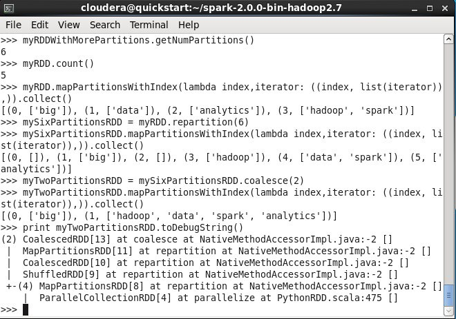
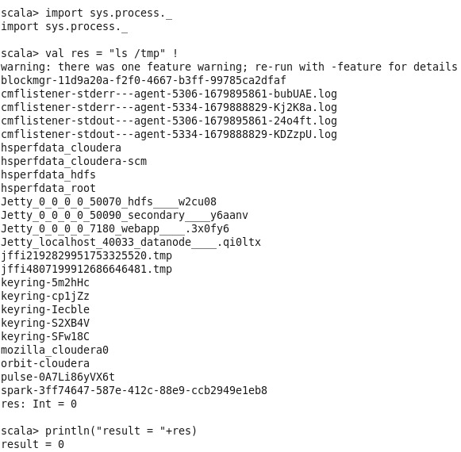

# Code-Chapter-3
Nama : Welson Mario Naibaho

Kelas : TI 3C

NIM : 2041720253

Matakuliah : Big Data

## Langkah-langkah dan penjelasan

1. Pertama masuk ke folder spark dengan cara

    <code> cd spark-2.0.0-bin-hadoop2.7</code>
    
2. Kemudian jalankan

    <code> bin/pyspark </code>

3. Mencoba <code>Accumulator.py</code>

    Disini berhasil untuk print myaccum.value. dan outputnya adalah 4950

4. Mencoba <code>BroadCast.py</code>

    Pada percobaan BroadCast, berhasil membuat list 1 sampai dengan 99 dengan atribut broadcastVar.value

5. Mencoba <code>LogAnalytics</code>

    - Disini membuat file dummy berformat .text kedalam direktori file://home/cloudera
    - Code diatas berfungsi untuk memfilter kata "Error" dan "Product"
    - Hasil dari LogAnalyrics menujukkan bahwa Total number of error record are 0 and Number of product pages visited that have Errors is 0
    - Menujukkan bahwa file sample3.txt tidak memiliki nilai error dan nilai product pada log file.

6. Mencoba <code>PairRDD</code>

    myPairRDD.key().collect()
        - menampilkan nilai dari mylist
    myPairRDD.values().collect()
        - Menampilkan jumlah kata dari collection

7. Mencoba <code>UnderstandingRDDS.py</code>

    Pada percobaan diatas, membuat sebuah list dengan menghitung jumlah partisi dan kemudian menampilkan data pada collection

8. Mencoba <code>WordCount.py</code>

    Dari percobaan diatas, dilakukan penjumlahan menggunakan atribut counts.collect()

### UJI COBA FILE .SCALA

    Pada terminal jalankan spark-shell dengan cara

- <code>cd spark-2.0.0-bin-hadoop2.7</code>

        Kemudian lakukan

- <code>bin/spark-shell</code>

    Pada Cloudera Manager, jalankan service HDFS

1. Mencoba <code>SystemCommandsOutput.scala</code>

    Hasil dari percobaan diatas adalah string "" dan result = , dikarenakan tidak terdapat file yang akan dihadoop

2. Mencoba <code>SystemCommandsReturnCode.scala</code>

    Dari percobaan diatas, menampilkan folder yang berisi temp file

